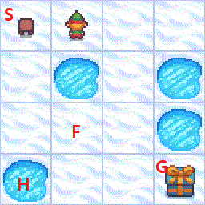

<br>

# What is Frozen Lake?

Frozen lake는 Gym Documents(강화학습을 위한 standard API)에 있는 Toy Text Environment 중 하나입니다.



Frozen Lake의 목적은 시작점(S)에서 구멍(H)에 빠지지 않고 얼음판(F) 위를 걸어 목적지(G)에 도달하는 것입니다. Agent는 4가지 action(상,하,좌,우)를 실행할 수 있고(다만, 미끄럼 기능(is_slippery)을 false로 설정해두지 않으면, 일정 확률로 이상한 방향으로 움직일 수 있습니다), 각 행동에 대한 보상(reward)은 아래와 같습니다:

* 목적지(G) 도달: +1
* 얼음판(F) 도달: 0
* 구멍(H) 도달: 0

<br>

# Libraries to import


```python
!pip install gym
!pip install gym[toy_text]
```


```python
import gym

import numpy as np
import random
```
<br>
# Creating an environment


```python
env = gym.make("FrozenLake-v1", is_slippery = False, render_mode="human")
```


```python
action_space_size = env.action_space.n # 가능한 action의 수를 return(= 4)
state_space_size = env.observation_space.n # 가능한 state의 수를 return(= 16)

qtable = np.zeros((state_space_size, action_space_size)) # action * state 크기의 qtable 제작 (전부 0으로 초기화)
```
<br>
# Training Variables


* Learning rate(α): 새로 학습한 값을 얼마나 수용할지 나타냅니다 (0~1).
* Discount rate(γ): 시간(step)이 지날 수록 보상(reward)의 가치가 얼마나 떨어질지 정합니다 (0~1).
* ε-Greedy policy: ε의 확률만큼 가장 큰 Q값을 뽑도록 행동(Exploit)하지 않고 도전(Exploration)을 합니다 (0~1).


```python
total_episodes = 10000
max_step = 100 # 무한루프가 발생하는 것을 방지

alpha = 0.2 # Learning rate
gamma = 0.001 # Discount rate

epsilon = 1 # ε-Greedy policy
max_epsilon = 1
min_epsilon = 0.01
decay_rate = 0.001
```
<br>
# Training with Q-Learning


* 위에 있는 두 줄을 주석 해제 하면 학습 과정을 시각적으로 볼 수 있습니다.


```python
#env.reset()
#env.render()

rewards = []

for episode in range(total_episodes):
    env.reset()
    state = 0
    step = 0
    terminated = False
    episode_reward = 0
    
    for step in range(max_steps):
        if(random.uniform(0,1) > epsilon): # ε의 확률로 Exploration
            action = np.argmax(qtable[state,:]) # Exploit: 가장 큰 Q(s,a) 값을 도출하는 action을 return
        else:
            action = env.action_space.sample() # Exploration: 랜덤한 action을 샘플
        
        new_state, reward, terminated, truncated, info = env.step(action) # .step()의 return값들
        
        # Q-Learning 공식
        qtable[state,action] = (1 - learning_rate) * qtable[state,action] + learning_rate * (reward + gamma * np.max(qtable[new_state,:]) - qtable[state, action])
        
        state = new_state # Agent의 state를 새로운 state로 바꿔줌
        
        if(terminated):
            break
            
        episode_reward += reward
        
    epsilon = min_epsilon + (max_epsilon - min_epsilon)*np.exp(-decay_rate * (episode)) # 지수적으로 ε를 줄여 점점 Greedy policy에 가까워지게끔 함 (= Exploration을 덜 하게 됨)
    rewards.append(episode_reward)
        
env.close()
```
<br>
# Testing the agent


* 테스트 횟수는 'test_episodes' 변수를 바꿔 조정할 수 있습니다.
* 다만, agent가 매번 가장 높은 Q 값을 뽑도록 (Greedy policy) 설정해 두어서, 테스트 횟수를 늘려도 agent는 매번 같은 동작을 반복할 것입니다.


```python
env = gym.make("FrozenLake-v1", is_slippery = False, render_mode="human")
env.reset()
env.render()

ave_reward = 0
test_episodes = 1 # 테스트 해볼 episode 수

for episode in range(test_episodes):
    env.reset()
    state = 0
    terminated = False
    
    print("Episode:", episode + 1)
    
    for step in range(max_steps):
        action = np.argmax(qtable[state,:]) # Exploit: 가장 큰 Q(s,a) 값을 도출하는 action을 return
        new_state, reward, terminated, truncated, info =  env.step(action)
        
        ave_reward += reward
        
        if terminated:
            print("Number of steps:",step)
            print("Reward:", reward)
            break
            
        state = new_state

print("Average reward:", ave_reward/test_episodes)

env.close()
```
<br>
# Conclusion


* Q-Learning을 통해 Frozen Lake 과제를 성공적으로 해결한 것을 확인할 수 있습니다.
* 10000개의 episode를 통해 학습해본 결과, average reward(score)는 0.87~0.88 정도가 나온 것을 확인할 수 있었습니다.
* 해당 문제에서 Learning rate(α)를 바꿔서 실험해봐도 성능에 큰 차이는 없었습니다.
* 앞서 설명하였듯, 구멍에 빠졌을 때의 보상(reward)은 기본값이 0이어서, 이를 -1로 바꿔봤음에도 성능적인 면에서 큰 차이는 없었습니다.
* 미끄럼 기능(is_slippery)를 활성화 해놓은 뒤, 같은 알고리즘을 실행해본 결과, 제대로 학습이 이루어지지 않았습니다. 똑같이 10000개의 episode를 통해 학습해본 결과 average reward(score)은 겨우 0.07 정도 밖에 나오지 않았습니다.
