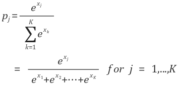
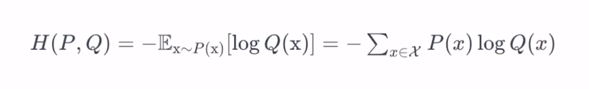
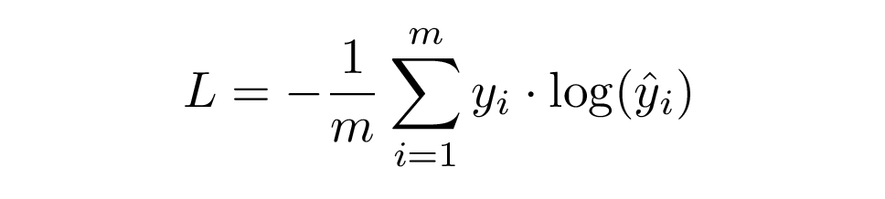

<br>

# 소프트맥스(Softmax) 함수
* k 차원의 벡터에서 j번째 원소를 x_j, j번째 클라스가 정답일 확률을 p_j로 나타낸다고 했을 때, softmax 함수는 p_j를 다음와 같이 정의합니다.



* 예를 들어, 첫번째 결과 값은 j가 1이 되고, 아래와 같이 계산됩니다.
  * (e^1) / (e^1 + e^2 + e^3) = 0.09
  * hypothesis를 출력했을 때 역시 첫번째 값이 0.09가 나오는 것을 확인할 수 있습니다.
* Softmax의 합은 항상 1이 됩니다.


```python
import torch
import torch.nn as nn
import torch.nn.functional as F
import torch.optim as optim

torch.manual_seed(1)

x = torch.FloatTensor([1, 2, 3])
hypothesis = F.softmax(x, dim = 0)
print(hypothesis)

print(hypothesis.sum())
```

    tensor([0.0900, 0.2447, 0.6652])
    
    tensor(1.)
    

<br>

# Cross Entropy
* Cross entropy는 두 확률 분포가 주어져 있을 때, 둘의 유사도를 나타내는 수치입니다.
* 확률 분포 P와 Q가 주어졌을 때, cross entropy는 다음과 같이 정의됩니다.



* 이를 이용해, cross entropy loss를 다음과 같이 계산할 수 있습니다.



* 아래의 예제에서, 클라스의 개수는 5개, 샘플의 개수는 3개입니다.
* hypothesis에서 출력한 값은 예측값(prediction)으로, y^에 해당합니다.


```python
x = torch.rand(3, 5, requires_grad = True) # uniform random하게 3 X 5 사이즈 텐서 생성
print(x)

hypothesis = F.softmax(x, dim = 1) # 두 번째 차원에 대해서 softmax를 진행
print(hypothesis) 
```

    tensor([[0.4550, 0.5725, 0.4980, 0.9371, 0.6556],
            [0.3138, 0.1980, 0.4162, 0.2843, 0.3398],
            [0.5239, 0.7981, 0.7718, 0.0112, 0.8100]], requires_grad=True)
    
    tensor([[0.1664, 0.1871, 0.1737, 0.2695, 0.2033],
            [0.2002, 0.1783, 0.2218, 0.1944, 0.2054],
            [0.1809, 0.2380, 0.2318, 0.1084, 0.2409]], grad_fn=<SoftmaxBackward0>)
    


```python
y = torch.randint(5, (3, )).long() # 랜덤한 정답(index) 생성
print(y)
```

    tensor([0, 3, 2])
    

## Cross Entropy Loss (Low-level)
* 원-핫 인코딩(One-hot encoding)은 선택해야하는 선택지의 개수만큼 차원을 가지면서, 각 선택지의 인덱스에 해당하는 원소에는 1, 나머지 원소는 0의 값을 가지도록 하는 표현 방법입니다.
* scatter 함수는 텐서에 원하는 인덱스(index)에 알맞게 값(src)을 할당해줍니다.
  * Syntax: .scatter_(dim, index, src, reduce=None)
* y는 기존에 (3, ) 텐서였지만, unsqueeze 해줌으로써 (3, 1) 텐서가 됩니다.
  * y가 tensor([0, 3, 2])에서 tensor([[0], [3], [2]])가 되게 됩니다.
* 따라서, y_one_hot의 두 번째 차원을 기준으로, y에 해당하는 인덱스에 1이라는 값을 할당해줍니다.
* 결과값을 보면, 순서대로 0, 3, 2번쨰 인덱스가 1이 된 것을 확인할 수 있습니다.
* cost를 계산하는 과정에서, sum(dim)을 해줌으로써 (3, 5)에서 (3, ) 텐서가 되고, 이를 다시 mean으로 평균을 취해줌으로써 스칼라(scalar)값이 됩니다.


```python
y_one_hot = torch.zeros_like(hypothesis) # hypothesis와 같은 크기로 0으로 차있는 텐서 생성
y_one_hot.scatter_(1, y.unsqueeze(1), 1) # _는 in-place 함수라는 의미
print(y_one_hot)

cost = (y_one_hot * -torch.log(hypothesis)).sum(dim=1).mean() # cross entropy loss 공식
print(cost)
```

    tensor([[1., 0., 0., 0., 0.],
            [0., 0., 0., 1., 0.],
            [0., 0., 1., 0., 0.]])
    
    tensor(1.6311, grad_fn=<MeanBackward0>)
    

## torch.nn.functional 이용해서 구하기
* F.nll_loss는 negative log likelihood(nll)로 마이너스를 붙여주고, 더한 뒤, 평균을 구해줍니다.
* cost 값이 위에서 계산한 cost 값과 같은 것을 확인할 수 있습니다.


```python
torch.log(F.softmax(x, dim = 1)) # Low-level

F.log_softmax(x, dim = 1) # High-level
```

    tensor([[-1.7935, -1.6760, -1.7504, -1.3114, -1.5929],
            [-1.6086, -1.7244, -1.5062, -1.6381, -1.5826],
            [-1.7096, -1.4354, -1.4617, -2.2223, -1.4236]], grad_fn=<LogBackward0>)
    
    tensor([[-1.7935, -1.6760, -1.7504, -1.3114, -1.5929],
            [-1.6086, -1.7244, -1.5062, -1.6381, -1.5826],
            [-1.7096, -1.4354, -1.4617, -2.2223, -1.4236]],
           grad_fn=<LogSoftmaxBackward0>)
    


```python
cost = (y_one_hot * -torch.log(F.softmax(x, dim = 1))).sum(dim=1).mean() # Low-level
print(cost)

cost = F.nll_loss(F.log_softmax(x, dim = 1), y) # High-level
print(cost)
```

    tensor(1.6311, grad_fn=<MeanBackward0>)
    
    tensor(1.6311, grad_fn=<NllLossBackward0>)
    


```python
F.cross_entropy(x, y) # log_softmax와 nll_loss를 합친 것
```


    tensor(1.6311, grad_fn=<NllLossBackward0>)


## 소프트맥스 회귀 구현하기 (Low-level)
* &#124;x_train&#124; = (m, 4), &#124;y_train&#124; = (m, )이기에 4차원의 백터를 받아서 어떤 클라스인지 예측하도록 하고자하는 것임을 알 수 있습니다.
* x_train의 각 샘플은 4개의 특성을 가지고 있고, 총 8개의 샘플이 존재합니다.
* y_train은 각 샘플에 대한 레이블으로, 해당 예제의 경우 0, 1, 2의 값을 가지기에 총 3개의 클라스가 존재하는 것을 알 수 있습니다.
* 따라서, 원-핫 인코딩한 결과는 8 X 3의 개수를 가져야하며, W 행렬은 4 X 3 크기를 가져야합니다.
  * &#124;x_train X W&#124; = (8, 4) X (4, 3) = (8, 3)


```python
x_train = [[1, 2, 1, 1], 
           [2, 1, 3, 2], 
           [3, 1, 3, 4], 
           [4, 1, 5, 5], 
           [1, 7, 5, 5], 
           [1, 2, 5, 6], 
           [1, 6, 6, 6], 
           [1, 7, 7, 7]]
y_train = [2, 2, 2, 1, 1, 1, 0, 0]

x_train = torch.FloatTensor(x_train)
y_train = torch.LongTensor(y_train)

W = torch.zeros((4,3), requires_grad = True)
b = torch.zeros(1, requires_grad = True)

optimiser = optim.SGD([W, b], lr = 0.1)
nb_epochs = 1000

for epoch in range(nb_epochs + 1):
    hypothesis = F.softmax(x_train.matmul(W) + b, dim = 1)
    
    y_one_hot = torch.zeros_like(hypothesis)
    y_one_hot.scatter_(1, y_train.unsqueeze(1), 1)
    
    cost = (y_one_hot * -torch.log(hypothesis)).sum(dim=1).mean()
    
    optimiser.zero_grad()
    cost.backward()
    optimiser.step()
    
    if epoch % 100 == 0:
        print('Epoch {:4d}/{} Cost: {:.6f}'.format(
            epoch, nb_epochs, cost.item()
        ))
```

    Epoch    0/1000 Cost: 1.098612
    Epoch  100/1000 Cost: 0.761050
    Epoch  200/1000 Cost: 0.689991
    Epoch  300/1000 Cost: 0.643229
    Epoch  400/1000 Cost: 0.604117
    Epoch  500/1000 Cost: 0.568255
    Epoch  600/1000 Cost: 0.533922
    Epoch  700/1000 Cost: 0.500291
    Epoch  800/1000 Cost: 0.466908
    Epoch  900/1000 Cost: 0.433507
    Epoch 1000/1000 Cost: 0.399962
    

## 소프트맥스 회귀 구현하기 (High-level)
* cost를 구할 때 F.cross_entropy를 사용하기 때문에, 원-핫 인코딩 과정을 생략할 수 있습니다.


```python
x_train = [[1, 2, 1, 1], 
           [2, 1, 3, 2], 
           [3, 1, 3, 4], 
           [4, 1, 5, 5], 
           [1, 7, 5, 5], 
           [1, 2, 5, 6], 
           [1, 6, 6, 6], 
           [1, 7, 7, 7]]
y_train = [2, 2, 2, 1, 1, 1, 0, 0]

x_train = torch.FloatTensor(x_train)
y_train = torch.LongTensor(y_train)

W = torch.zeros((4,3), requires_grad = True)
b = torch.zeros(1, requires_grad = True)

optimiser = optim.SGD([W, b], lr = 0.1)
nb_epochs = 1000

for epoch in range(nb_epochs + 1):
    z = x_train.matmul(W) + b
    
    cost = F.cross_entropy(z, y_train)
    
    optimiser.zero_grad()
    cost.backward()
    optimiser.step()
    
    if epoch % 100 == 0:
        print('Epoch {:4d}/{} Cost: {:.6f}'.format(
            epoch, nb_epochs, cost.item()
        ))
```

    Epoch    0/1000 Cost: 1.098612
    Epoch  100/1000 Cost: 0.761050
    Epoch  200/1000 Cost: 0.689991
    Epoch  300/1000 Cost: 0.643229
    Epoch  400/1000 Cost: 0.604117
    Epoch  500/1000 Cost: 0.568255
    Epoch  600/1000 Cost: 0.533922
    Epoch  700/1000 Cost: 0.500291
    Epoch  800/1000 Cost: 0.466908
    Epoch  900/1000 Cost: 0.433507
    Epoch 1000/1000 Cost: 0.399962
    

## nn.Module로 소프트맥스 회귀 구현하기


```python
class SoftmaxClassifierModel(nn.Module):
    def __init__(self):
        super().__init__()
        self.linear = nn.Linear(4, 3) # W
        
    def forward(self, x):
        return self.linear(x)
    
model = SoftmaxClassifierModel()
```


```python
x_train = [[1, 2, 1, 1], 
           [2, 1, 3, 2], 
           [3, 1, 3, 4], 
           [4, 1, 5, 5], 
           [1, 7, 5, 5], 
           [1, 2, 5, 6], 
           [1, 6, 6, 6], 
           [1, 7, 7, 7]]
y_train = [2, 2, 2, 1, 1, 1, 0, 0]

x_train = torch.FloatTensor(x_train)
y_train = torch.LongTensor(y_train)

optimiser = optim.SGD(model.parameters(), lr = 0.1)
nb_epochs = 1000

for epoch in range(nb_epochs + 1):
    prediction = model(x_train)
    
    cost = F.cross_entropy(prediction, y_train)
    
    optimiser.zero_grad()
    cost.backward()
    optimiser.step()
    
    if epoch % 100 == 0:
        print('Epoch {:4d}/{} Cost: {:.6f}'.format(
            epoch, nb_epochs, cost.item()
        ))
```

    Epoch    0/1000 Cost: 1.957862
    Epoch  100/1000 Cost: 0.648384
    Epoch  200/1000 Cost: 0.566425
    Epoch  300/1000 Cost: 0.511825
    Epoch  400/1000 Cost: 0.467093
    Epoch  500/1000 Cost: 0.427281
    Epoch  600/1000 Cost: 0.390088
    Epoch  700/1000 Cost: 0.354014
    Epoch  800/1000 Cost: 0.317913
    Epoch  900/1000 Cost: 0.281275
    Epoch 1000/1000 Cost: 0.249264
    

<br>

# 소프트맥스 회귀 vs 로지스틱 회귀
* 소프트맥스 회귀:
  * 여러개의 클라스가 있을 때 사용
  * Cross Entropy loss와 소프트맥스 사용
* 로지스틱 회귀:
  * 이진분류 문제일 경우 로지스틱 회귀 사용
  * Binary Cross Entropy loss와 시그모이드를 사용

<br>

출처 | "모두를 위한 딥러닝 시즌2", Deep Learning Zero To All, https://www.youtube.com/playlist?list=PLQ28Nx3M4JrhkqBVIXg-i5_CVVoS1UzAv
